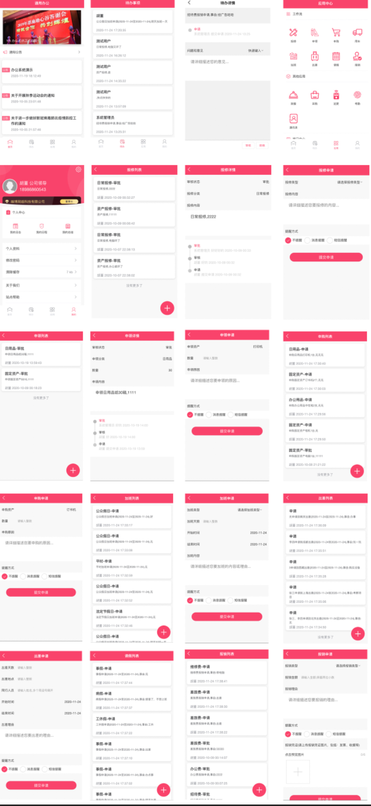
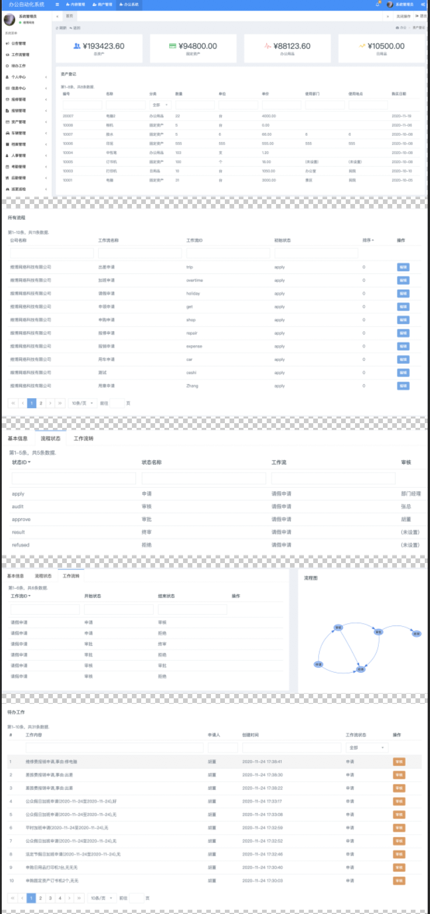

# 简介
Uni-OA通用办公系统主要为国内企业提供办公自动化信息服务，功能为如：工作流自定义，个人中心(通讯录、我的日志、我的日程、我的总结)；信息中心(新闻动态、下载中心、公告管理)、学习中心(制度管理、业务知识、安全知识)；工作审批(报修管理、报销管理、用车申请、请假管理、加班管理、出差管理、申购管理、申领管理)、资产管理、车辆管理、档案管理、人事管理(员工信息、合同管理、奖惩管理、社保管理、)、考勤管理(班次管理、排班管理、我的排班、签到签退)、后勤管理、巡更巡检、公告管理、日常管理、巡更巡检(地点管理、巡更班次、巡更计划、我的排班、巡更记录)、意见反馈、站点帮助、在线客服、一键换肤等功能模块。
系统前端基于uniapp开发，后端基于php开发；该系统可独立部署在自己的服务器，且支持单企业版和多企业版本；目前已适配H5、微信小程序、安卓和ios，如果在试用或购买后发现问题，欢迎您随时提出。

### 咨询与售后

作者QQ：21931118 QQ群：1107210028
如您已下载本插件，可加入QQ群获得技术、部署与上架指导；

### 系统演示

1. 后台演示：请联系作者
2. 手机端演示：测试账号密码 18986868888/18986868888 管理账号 13277562585/hjp12321

### 部分截图

### 开始使用

1. 将项目导入HBuildX
2. 修改配置文件config/index.conf.js内配置对应参数
3. 运行即可体验

### 发行微信小程序

在HBuildx顶部菜单点击运行->运行到微信小程序
使用微信开发者工具上传版本并审核通过即可
>注意：小程序需额外配置服务器域名

### 发行H5

在HBuildx顶部菜单点击发行->网站-H5手机版
在弹出的对话框中输入网站标题和域名即可，将编译后的资源部署到服务器（虚拟主机）
>需注意HBx直接部署网页托管需要最新版，老版本没有这个选项，可以自己到web控制台进行托管。
点击发行，等待项目编译部署即可。
如果您不想购买服务器，那就来uniCloud白嫖一波吧~

### 发行ios版和安卓版
在HBuildx顶部菜单点击发行->原生App-云打包，
在弹出的对话框中选择证书文件和输入密码即可。

### 知识产权及使用授权

您可以自由下载、使用本插件用于学习和交流的用途而不需要向该插件的作者付费。 该插件的作者所拥有的知识产权，包括但不限于商标、专利、著作权、商业秘密、专有数据、源码，并不发生转移或共享。 

### 您的义务

您不得利用该插件在未征得作者同意的情况下提供商业用途谋利或侵害作者利益， 未经书面许可您不可利用该插件的全部或部分文件、模块、组件来制作与该插件作者争夺用户的产品。 如果您违反您的义务，作者将有权停止您使用本框架，造成的损失由您自行承担。 如果您给该插件作者造成重大损失，或者在接收到该插件作者的停止违约通知后拒不改正，该插件作者将有权停止对您的该插件的使用授权，因此造成的损失由您自行承担。 如果您的行为产生法律问题，该插件作者有权追责您的法律责任。

### 安全

您理解并同意，本插件同其他软件一样，无法承诺绝对的安全性。 当该插件作者发现本插件的任何安全漏洞时，将及时发布紧急更新补丁或新版本。

### 免责声明

该插件主要为学习交流使用，作者不因其他开发者使用本插件而承担任何法律责任。

### 协议修订

根据发展，该插件作者可能会对本协议进行修改。修改时，作者会在产品或者网页中显著的位置发布相关信息。如果您选择继续使用本插件，即表示您同意接受这些修改。

### 致谢

>感谢开发过程中小明和简言对我的技术支持；感谢以下的项目，排名不分先后

TinyShop-UniApp:https://github.com/stavyan/TinyShop-UniApp

Vuejs： https://github.com/vuejs/vue

uni-app： https://uniapp.dcloud.io/

mix-mall: https://ext.dcloud.net.cn/plugin?id=200

ColorUI: https://github.com/weilanwl/ColorUI

